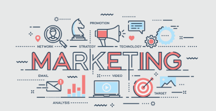
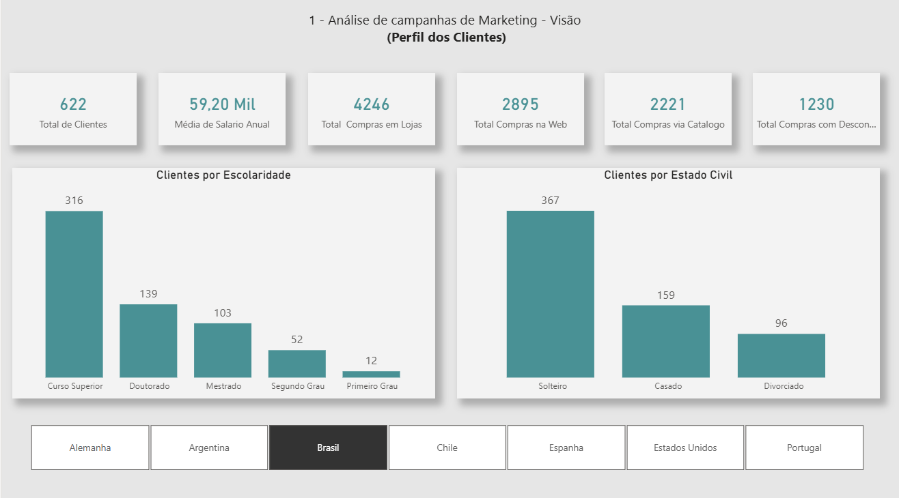
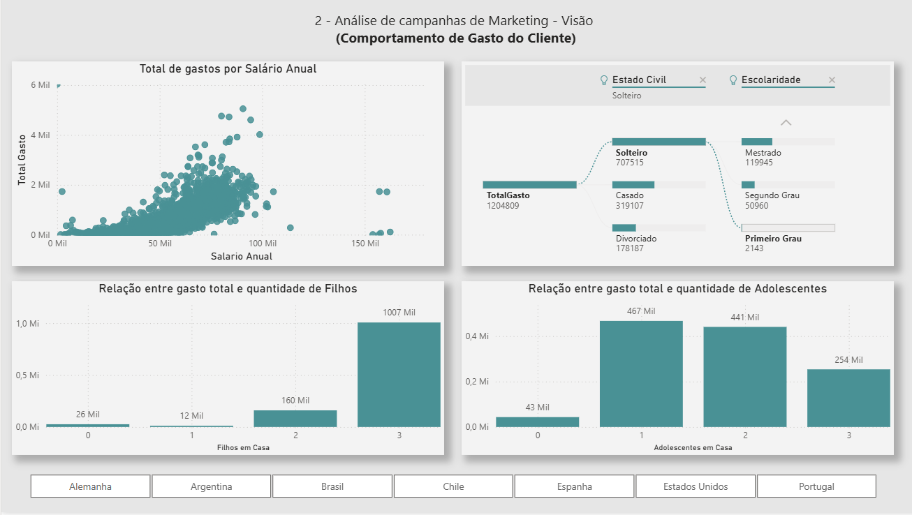
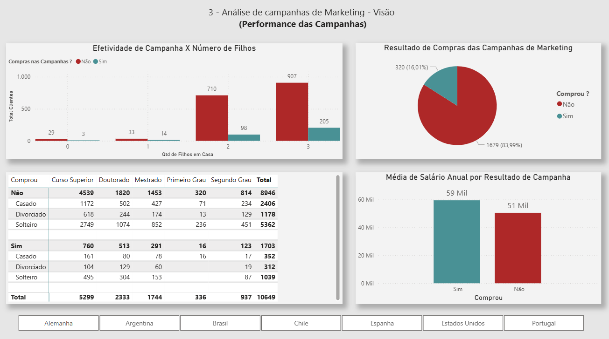
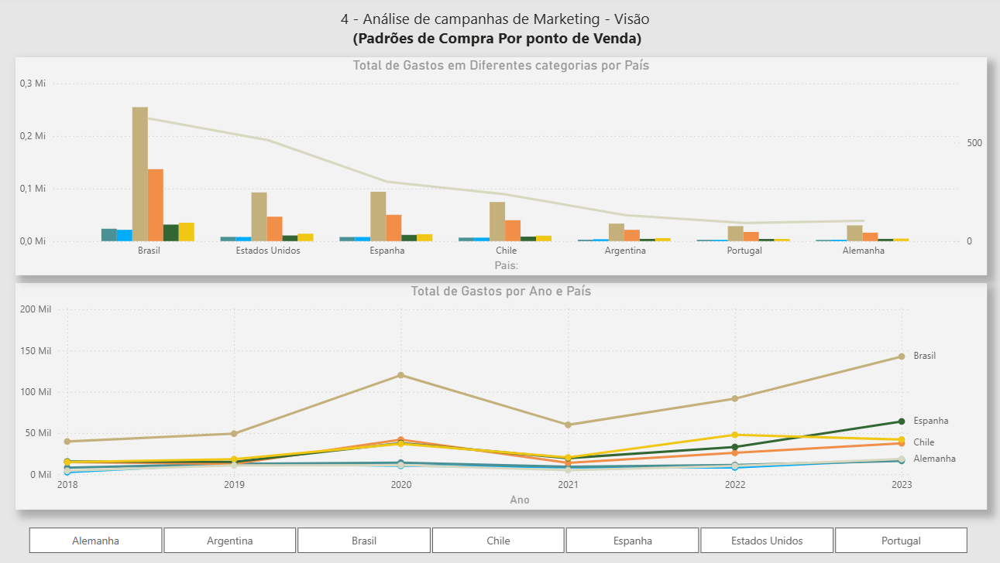

<div align="center">
  
</div>

<h1 align="center"><strong> Análise  de  campanhas  de Marketing com o Power BI 
<a href="https://powerbi.microsoft.com/" target="_blank" rel="noreferrer">
   
</a> </strong></h1>

O marketing é o processo de planejar e executar a concepção, preço, promoção e distribuição de ideias, bens e serviços com o objetivo de criar trocas que satisfaçam metas individuais e organizacionais. É uma das funções mais estratégicas dentro de uma empresa, sendo responsável por atrair e manter clientes, além de impulsionar o crescimento do negócio.

Entre suas principais atribuições estão:

- **Atrair  novos  clientes:**  Por meio de campanhas publicitárias e estratégias de captação.
- **Aumentar as vendas:** Criando promoções e ações que incentivem a compra.
- **Criar conscientização da marca:** Aumentando a conscientização e reconhecimento entre o público-alvo.
- **Fidelizar clientes:** Com estratégias de retenção e relacionamento.
- **Entender  o  mercado:**  Compreendendo desejos, necessidades e tendências para decisões mais assertivas.
---
# 🔍 Principais KPIs (Key Performance Indicators) de Marketing
Monitorar indicadores de desempenho é essencial para avaliar a eficácia das campanhas. Os principais KPIs incluem:
- **Taxa de conversão:** A proporção de visitantes do site que realizam uma ação desejada, como comprar um produto ou preencher um formulário de contato.
- **Taxa de retenção  do  cliente:** A proporção de clientes que compram de uma empresa novamente.
- **Custo por aquisição de cliente (CAC):** O custo total de adquirir um novo cliente, incluindo despesas com publicidade e marketing.
- **Retorno sobre investimento (ROI):** O lucro ou prejuízo obtido em relação ao investimento feito em uma campanha de marketing.
- **Conscientização da marca:** A medida da familiaridade e reconhecimento da marca entre o público-alvo.
- **Engajamento:** A medida da interação dos usuários com conteúdo, campanhas e canais de marketing.
- **Net Promoter Score (NPS):** Uma  medida  da  lealdade  dos  clientes,  baseada  em  sua disposição para recomendar uma empresa ou produto para outras pessoas.
- **Tráfego do website:** Número de visitas no website.
Além dos KPIs, é fundamental entender o perfil dos clientes, seus hábitos de consumo e padrões de compra.
---
```
Este projeto tem como foco responder perguntas estratégicas sobre o comportamento dos clientes e a performance das
campanhas de marketing, utilizando o Power BI como ferramenta de análise.
```
---
## 1. Visão do Cliente
Nesta visão, buscamos entender o perfil dos clientes:
- Como estão distribuídos por grau de escolaridade?
- Qual o estado civil predominante?
- Qual a média salarial dos clientes?
- Por qual canal foram realizadas as compras?
<div align="center">
  
</div>


## 2. Visão do Comportamento de Compra do Cliente
Nesta visão, analisamos como diferentes características demográficas influenciam o comportamento de consumo:
- Qual a relação entre salário anual e total de gastos?
- A presença de filhos ou adolescentes no domicílio impacta os gastos?
- O estado civil influencia no padrão de compra?
- A escolaridade está relacionada ao volume de gastos?
- Qual perfil demográfico apresenta maior propensão ao consumo?
<div align="center">
  
</div>


## 3. Visão da Performance das Campanhas de Marketing
Nesta seção, avaliamos a efetividade das campanhas de marketing com base em diferentes variáveis demográficas e socioeconômicas:

- Qual a proporção de clientes que realizaram compras durante as campanhas?
- O número de filhos influencia na decisão de compra?
- Há diferença na média salarial entre quem comprou e quem não comprou?
- O estado civil e o nível de escolaridade impactam na efetividade das campanhas?

<div align="center">
  
</div>


## 4. Visão dos Padrões de Compra no Ponto de Venda (País)
Nesta seção, analisamos o desempenho das campanhas de marketing em diferentes países e ao longo do tempo:

- Quais países apresentam maior volume de gastos por categoria de produto?
- Como evoluíram os gastos entre os anos de 2018 a 2023?
- Quais países demonstram maior consistência ou crescimento nos padrões de compra?

<div align="center">
  
</div>


## Assista à interatividade

[](https://youtu.be/eOT5xFxVId4)

# 📈 Conclusão: Impacto Estratégico para o Marketing
A análise detalhada das campanhas de marketing por meio do Power BI permite que as empresas tomem decisões mais informadas e estratégicas. Ao compreender o perfil dos clientes, seus comportamentos de compra, 
a efetividade das campanhas e os padrões por país, o setor de marketing pode:

* Segmentar melhor o público-alvo, criando campanhas personalizadas que aumentam a taxa de conversão.
* Otimizar investimentos, direcionando recursos para canais e regiões com maior retorno.
* Aprimorar a comunicação da marca, adaptando a linguagem e abordagem conforme o perfil demográfico.
* Identificar oportunidades de crescimento, com base em padrões de consumo e tendências regionais.
* Fortalecer a fidelização, ao entender o que realmente importa para cada grupo de clientes.
* Essas ações não apenas aumentam a eficiência das campanhas, mas também contribuem diretamente para o fortalecimento da marca, tornando-a mais relevante, reconhecida e conectada ao seu público.
---
# 🧪 Teste e Explore com Seus Próprios Dados
Este projeto foi desenvolvido com base em um conjunto específico de dados de campanhas de marketing, mas a estrutura e os dashboards são totalmente adaptáveis. Se você deseja:

Testar os relatórios com os arquivos originais, basta baixar os arquivos disponíveis neste repositório e abrir o relatório .pbix no Power BI.
Explorar com seus próprios dados, substitua os dados originais por informações do seu contexto (como campanhas de outra empresa, produtos ou localidade) e veja como os insights se transformam.
Sinta-se à vontade para clonar o repositório e adaptar os dashboards.


---
🧠 Feito com café ☕ por Naty
